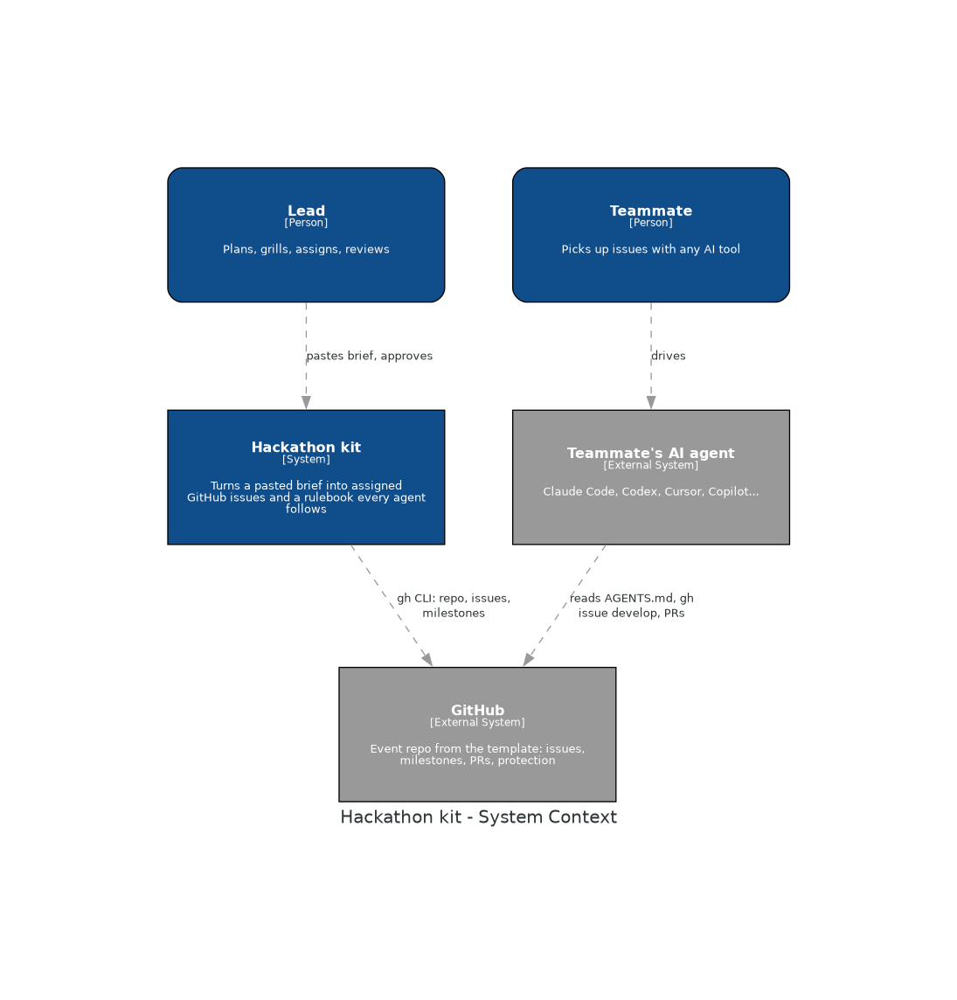
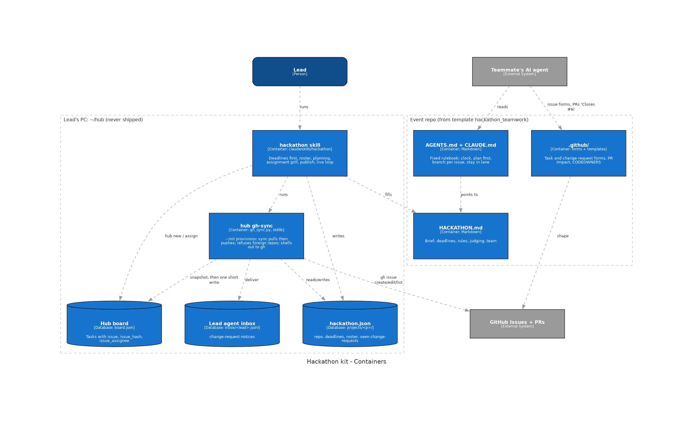
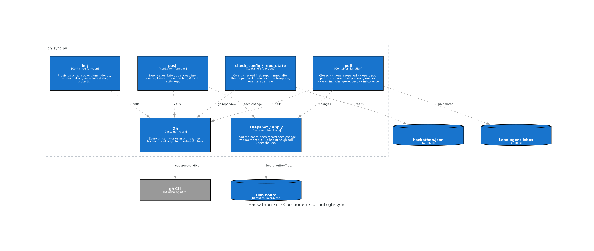
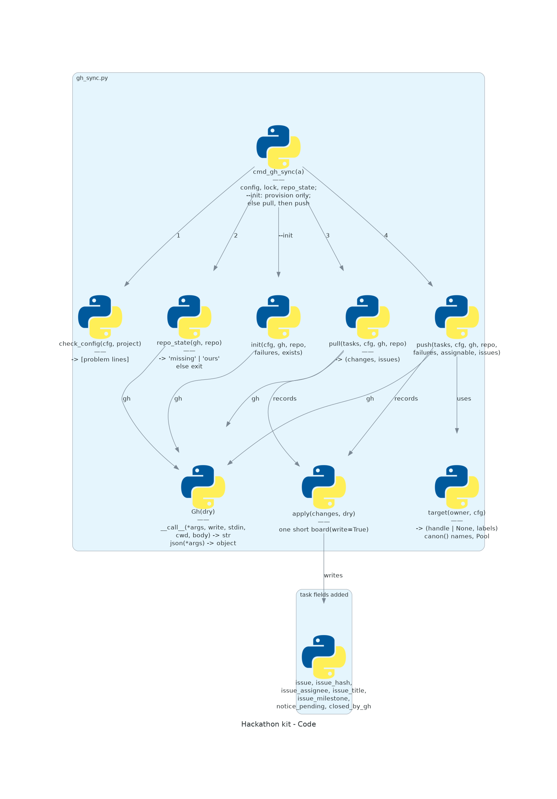

# The hackathon kit

Run a hackathon team the way the hub runs agents: the whole team plans the project first,
together at the lead's laptop, then every task becomes a GitHub Issue, and every teammate's AI
agent follows one rulebook so nobody one-shots the project and five agents don't overwrite
each other.

Three parts:

| Part | Where | What it does |
|---|---|---|
| **Template repo** | [atiladeokegab/hackathon_teamwork](https://github.com/atiladeokegab/hackathon_teamwork), copied once to your account | What teammates see: `AGENTS.md` (the rulebook their agent follows), `IDEA.md`, `HACKATHON.md`, issue forms, PR template, a README guide with diagrams |
| **`hub gh-sync`** | `hub/gh_sync.py` | Pushes the event's hub tasks to GitHub Issues and pulls back what happened: closed, picked up, change-requests |
| **`hackathon` skill** | `claude/skills/hackathon/` | The lead agent's script: deadlines first, roster, pitch round, plan, areas and assignment, `IDEA.md` gate, publish, live review loop with smoke checks |

## Diagrams

| | |
|---|---|
| **Context:** who uses it |  |
| **Containers:** the lead's PC and the event repo |  |
| **Components:** inside `hub gh-sync` |  |
| **Code** |  |

Redraw with `uv run docs/hackathon-kit/c4.py` (needs Graphviz). The teammate-facing flow
diagrams live in the template's README.

## One-time setup

1. `gh auth login` as yourself.
2. Make your own template (its `CODEOWNERS` must name you):

   ```bash
   gh repo create <you>/hackathon_teamwork --template atiladeokegab/hackathon_teamwork --public --clone
   cd hackathon_teamwork && echo "* @<you>" > .github/CODEOWNERS
   git commit -am "chore: I own this template" && git push
   gh repo edit <you>/hackathon_teamwork --template
   ```

## Each event

Open your lead agent and paste the event brief; the `hackathon` skill takes it from there.
It writes `$HUB_DIR/projects/<event>/hackathon.json`:

```json
{"repo": "<you>/<event>", "template": "<you>/hackathon_teamwork", "timezone": "Europe/London",
 "deadlines": [{"name": "code freeze", "at": "2026-10-04T14:00+01:00"},
               {"name": "submit", "at": "2026-10-04T15:00+01:00"}],
 "roster": [{"name": "You", "github": "<you>", "lead": true},
            {"name": "Sam", "github": "sam-gh"}]}
```

```bash
hub gh-sync --project <event> --init --dry-run   # read what it would do
hub gh-sync --project <event> --init             # repo from template, invites, labels, milestones,
                                                 # an `integration` default branch, protection on it and main
# ...push IDEA.md, HACKATHON.md and the README...
hub gh-sync --project <event>                    # every task becomes an issue; rerun any time
```

`--init` only provisions: no issue exists until the approved `IDEA.md` is pushed.

## How the work flows

- **Areas.** Planning gives each person an area (directories) by strength. Inside it their
  agent changes what the task needs and may open its own `task` issues; anything outside it
  is a change-request to the lead.
- **`integration`, then `main`.** PRs land on `integration`, the default branch. After each
  merge the lead agent runs the project's `Smoke:` command (tests plus one end-to-end run) in
  a throwaway worktree: green moves `main` forward, red reverts the merge and reopens the
  issue. `main` is always the last working version, and at code freeze it's what ships.
- **Questions.** An agent with a question outside its area opens a `question` issue for the
  area's owner, keeps building on a stated guess, and applies the answer when it comes. The
  owner's agent shows the question to its person with a draft answer.

If you copied the template before these rules existed, pull the new `AGENTS.md`, `README.md`,
`IDEA.md`, `HACKATHON.md` and `.github/` into your copy.

## What gh-sync guarantees

- **Never the wrong repo.** The repo must be named after the project and created from
  your template, or nothing is written.
- **The hub owns each brief.** A brief, title, deadline or owner changed on the hub
  reaches the issue, with a "Brief updated" comment. An issue body edited on GitHub is
  never overwritten; you get a warning instead.
- **GitHub owns what happened.** Closed issues mark tasks done, a reopened one reopens
  its task, a pool pickup sets the owner, and a change-request reaches the lead agent's
  inbox exactly once.
- **Safe to repeat.** Every change is recorded the moment GitHub has it, so a crash can't
  duplicate issues. Two syncs at once are refused. A bad `hackathon.json` is one error
  line, before any GitHub call.
- **People who haven't accepted the invite** get their issues unassigned, and are
  assigned on the first sync after they accept.

Hub agents on your roster (`HUB_LEAD`, `HUB_CLAUDE_AGENTS`, `HUB_CODEX_AGENTS`) work as
your hands: their issues are assigned to your handle and labelled `agent:<name>`.

## Proven

Rehearsed on real GitHub, including with a second account as a teammate:
- The teammate can't merge without the lead's approval, not even with `--admin`.
- The teammate can't push to `main`.
- A push after approval cancels the approval.
- A fine-grained personal access token can't accept the invite or push, so teammates log
  in with `gh auth login`.

Tests: `python3 hub/tests/test_gh_sync.py` (54 cases against a stub `gh`).

**Not yet rehearsed on real GitHub:** the `integration` flow (smoke, promote, revert) and
questions. They are covered by tests and scripted checks only.

**Not yet run on:** macOS, or a full Windows session. The commands are checked in Windows
PowerShell 5.1.
